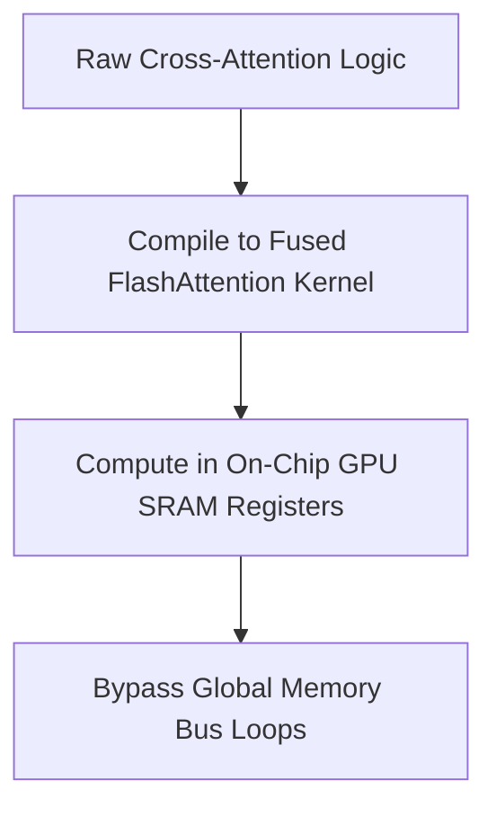

# The Attention Sequence Cache Memory Crisis

[← Back to Main README](../README.md)

## Overview
In modern Diffusion Transformers (DiTs), scaling prompt sequences with long text context lengths alongside high-resolution images creates an attention matrix memory bottleneck.

## The VRAM Bottleneck
Self-attention memory complexity scales quadratically with sequence length:

$$\mathcal{O}((N_{img} + N_{txt})^2)$$

When batch size is doubled for CFG, VRAM requirements scale dramatically, triggering Out-Of-Memory (OOM) errors.

## Hardware Acceleration Flow

