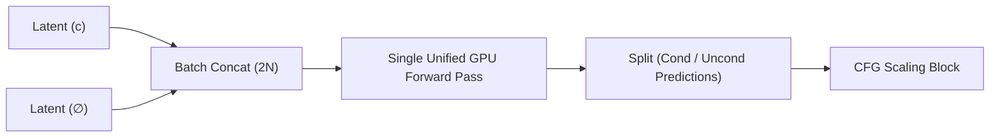

# Batch Concatenation Kernels

[← Back to Main README](../README.md)

## Overview
To optimize hardware utilization, modern inference engines concatenate conditional and unconditional text conditioning paths into a single double-sized batch.

## Execution Pattern
Instead of running two sequential forward passes on the GPU:
1. Pass 1: Cond inputs (batch size $N$)
2. Pass 2: Uncond inputs (batch size $N$)

They are combined into batch size $2N$:

$$\text{Input Batch} = \text{Concat}(x_t^c, x_t^\emptyset)$$

## Processing Pipeline

