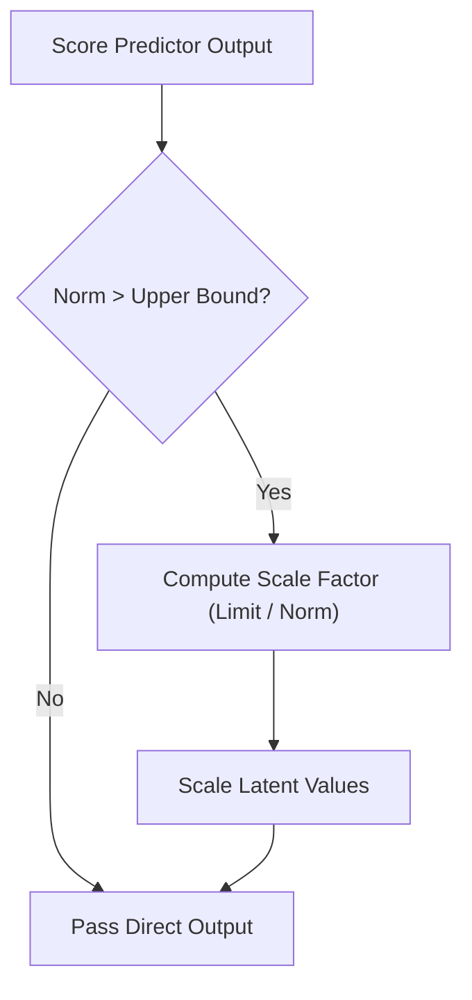

# CFG Clamping Filters

[← Back to Main README](../README.md)

## Overview
High Classifier-Free Guidance scales push latent values into extreme ranges, which causes visual artifacts like exposure blowout and oversaturated colors. Clamping filters resolve this issue by restricting or scaling back latent norms.

## Mechanism
- **Static Thresholding:** Simple clipping of values to $[-s, s]$.
- **Dynamic Thresholding:** Calculates a high percentile absolute value $p$ at each step. If $p$ exceeds the threshold limit, the latent tensor is scaled back by $s/p$.

## Filtering Flow

