# The Double-FLOP Computational Latency Wall

[← Back to Main README](../README.md)

## Overview
Because CFG evaluates both the conditional and unconditional score paths at every denoising iteration, it doubles the floating-point operations (FLOPs) compared to unguided generation.

## Mitigation: Speculative CFG Skipping
Studies show that the unconditional pathway is primarily useful in early steps to establish semantic composition. We can skip the unconditional pass during the later stages (e.g., last 30-40% steps) to save compute.

## Computation Profile Comparison

```mermaid
gantt
    title Denoising Inference Passes (30 Steps)
    dateFormat  X
    axisFormat %s
    section Standard CFG
    Dual Passes (Cond + Uncond) : active, 0, 30
    section Skip-CFG
    Dual Passes (Steps 1-18) : active, 0, 18
    Single Pass (Steps 19-30) : 18, 30
```

