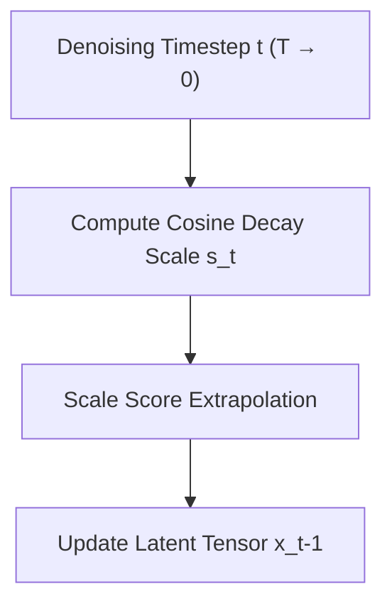

# Dynamic CFG / Cosine Scheduling

[← Back to Main README](../README.md)

## Overview
Replaces static scalar settings with a scheduling function $s_t = f(t)$. This prevents saturating images at late steps while ensuring strong prompt adherence in early steps.

## Cosine Decay Formula
A common cosine scheduler is parameterized as:

$$s_t = s_{min} + (s_{max} - s_{min}) \cdot \cos\left(\frac{\pi}{2} \cdot \frac{t}{T}\right)$$

## Scheduler Workflow

