# The Dynamic Scaling & Time-Step Scheduling Era

[← Back to Main README](../README.md)

## Overview
As static CFG scales often lead to oversaturation or exposure defects, dynamic scaling and schedules were introduced (~2023-2024) to adapt the guidance scale dynamically across denoising timesteps.

## Mechanism
The static scalar $s$ is replaced with a scheduler $s(t)$, which typically starts low during the early layout phase ($t \approx T$) and ramps up or decays as it reaches the fine details phase ($t \approx 0$):

$$s(t) = (s_{max} - s_{min}) \cdot f(t) + s_{min}$$

## Timeline Schedule

```mermaid
gantt
    title CFG Schedule Over Timesteps (t)
    dateFormat  X
    axisFormat %s
    section Denoising Stage
    Macro Structure (Low CFG) : active, 0, 10
    Semantic Midtones (High CFG) : 10, 25
    Texture refinement (Low CFG) : 25, 30
```

