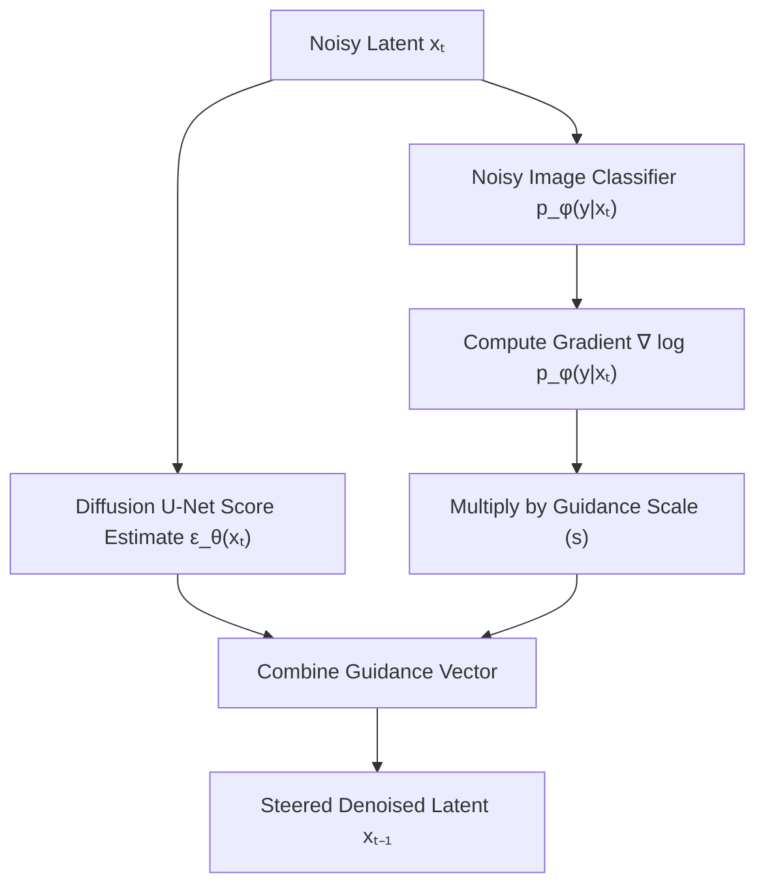

# External Classifier Guidance Era

[← Back to Main README](../README.md)

## Overview
**Classifier Guidance** was the first major breakthrough in steering diffusion models towards target conditional distributions (e.g., specific text prompts or class labels). Introduced by Dhariwal & Nichol in 2021, it allowed diffusion models to trade off sample diversity for visual fidelity.

## Mechanism
In Classifier Guidance, an external classifier network $p_\phi(y \mid x_t)$ is pre-trained on noisy images $x_t$ at various noise levels $t$. During the sampling process of the diffusion model, the gradients of the classifier with respect to the input image are computed and used to shift the score estimation step:

$$\tilde{\epsilon}_\theta(x_t, y) = \epsilon_\theta(x_t) - \sqrt{1 - \bar{\alpha}_t} \cdot s \cdot \nabla_{x_t} \log p_\phi(y \mid x_t)$$

where $s$ is the guidance scale.

## Architectural Flow
Below is a Mermaid diagram demonstrating how the external classifier feeds gradients back into the denoising loop:

## Key Limitations
- **Fragility:** Vulnerable to adversarial attacks. The diffusion model often generates high-frequency patterns that trick the classifier mathematically but look distorted to humans.
- **Complexity:** Requires training a separate classifier network specifically on noisy data.
