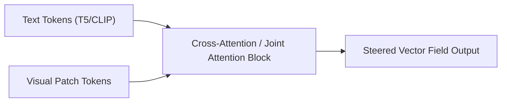

# The Flow-Matching Diffusion Transformer Era

[← Back to Main README](../README.md)

## Overview
Modern architectures (such as SD3, FLUX.1) utilize **Diffusion Transformers (DiT)** operating over linear ordinary differential equations (ODEs) rather than U-Nets, enabling native CFG scaling across multimodal representations.

## Flow Matching Formulation
Flow matching constructs a vector field $u_t(x)$ that generates a probability path from noise to data:

$$\mathrm{d}x_t = u_t(x_t) \mathrm{d}t$$

Classifier-free guidance is applied directly to the vector field predictions:

$$\tilde{u}_t(x_t, c) = u_t(x_t, \emptyset) + s \cdot (u_t(x_t, c) - u_t(x_t, \emptyset))$$

## Transformer Patch Alignment

