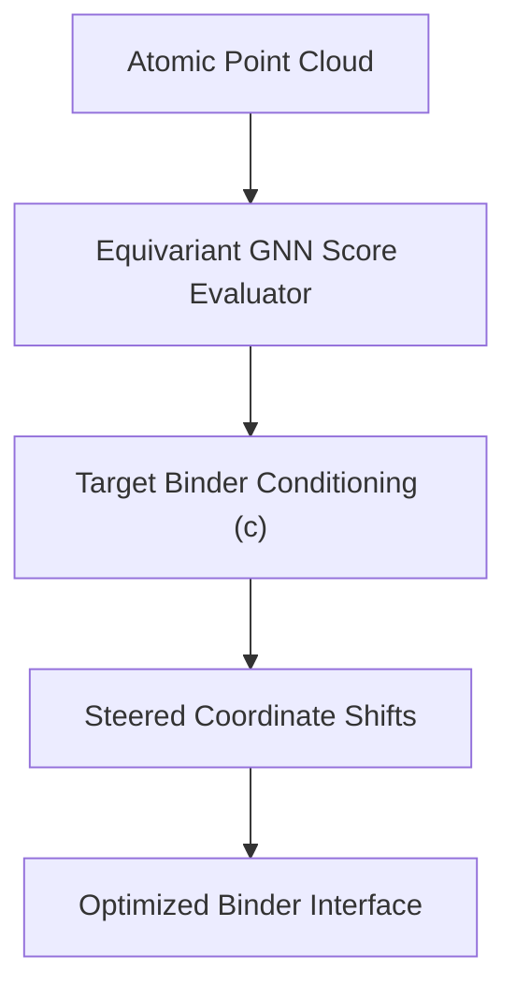

# De Novo Bio-Informatics Molecular Coordinate Diffusion

[← Back to Main README](../README.md)

## Overview
De Novo molecular diffusion networks (such as RFdiffusion or AlphaFold 3) utilize Classifier-Free Guidance parameters to generate atomic coordinate systems that target explicit biological functions.

## Folding Steering
Rather than generating arbitrary protein coordinates, CFG steers the generation along paths that satisfy structural binding constraints:

