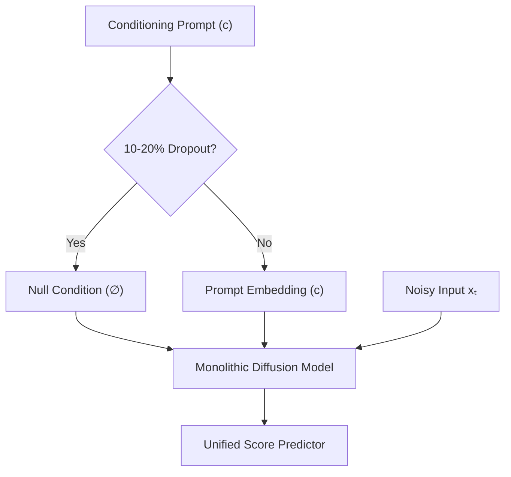

# Monolithic Joint-Embedding Revolution (Classifier-Free Guidance)

[← Back to Main README](../README.md)

## Overview
**Classifier-Free Guidance (CFG)**, introduced by Jonathan Ho and Tim Salimans in 2021, bypassed the need for an external classifier network by training a single monolithic model to predict both conditional and unconditional outputs.

## Mechanism
During training, the conditioning signal $c$ is randomly replaced with a null token $\emptyset$ (dropout rate of 10-20%). During inference, the guided output is calculated as:

$$\tilde{\epsilon}_\theta(x_t, c) = \epsilon_\theta(x_t, \emptyset) + s \cdot \left( \epsilon_\theta(x_t, c) - \epsilon_\theta(x_t, \emptyset) \right)$$

where $s \ge 1$ is the guidance scale.

## Architectural Flow

## Advantages
- Bypasses adversarial texture corruption.
- Eliminates secondary classifier pipeline overhead during inference.
