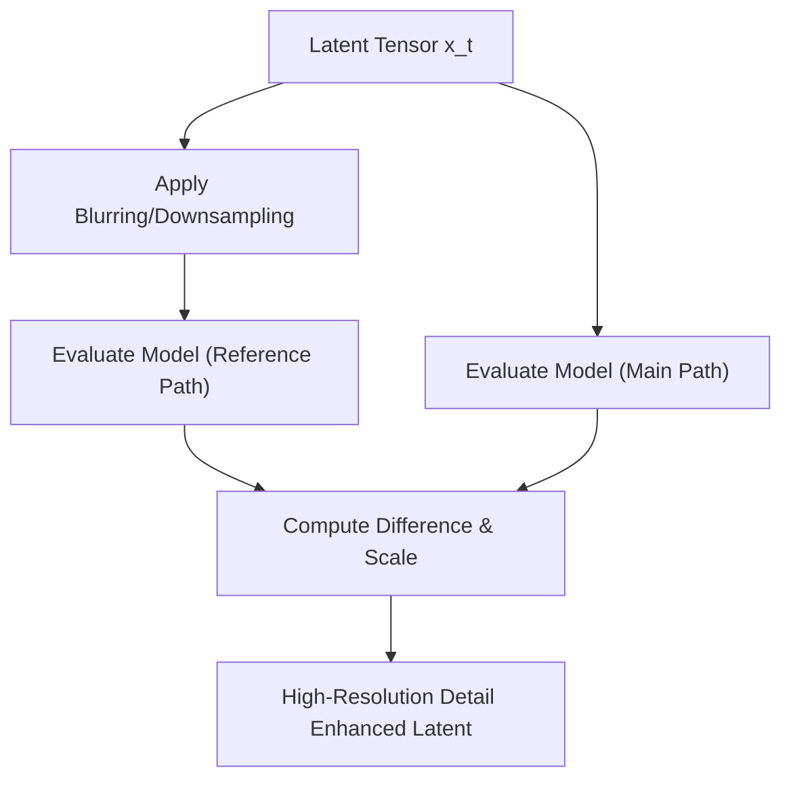

# Self-Self Guidance (SSG)

[← Back to Main README](../README.md)

## Overview
An advanced variation that executes guidance without any textual or external prompt dependencies. It performs guidance by using the model's own intermediate properties or self-attention outputs.

## Mechanism
It uses a transformed version (such as blurred or downsampled) of the intermediate image tensor as the reference baseline "unconditional reference", guiding the primary high-resolution output against its own layout profile.

## Pipeline Flow

