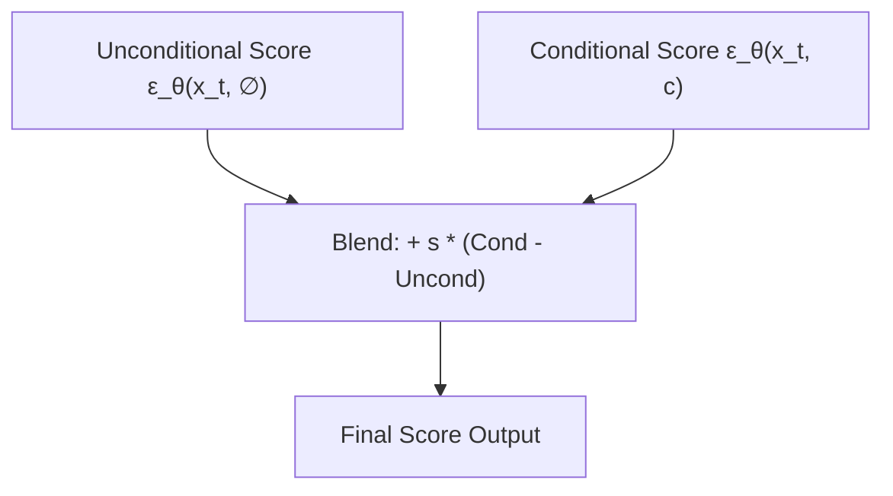

# Standard Linear CFG (Score Space Optimization)

[← Back to Main README](../README.md)

## Overview
The standard formulation of Classifier-Free Guidance interpolates or extrapolates between conditional and unconditional score estimations.

## Mathematics
$$\tilde{\epsilon}_\theta(x_t, c) = \epsilon_\theta(x_t, \emptyset) + s \cdot \left( \epsilon_\theta(x_t, c) - \epsilon_\theta(x_t, \emptyset) \right)$$

For $s > 1$, the scores are pushed along the direction of prompt alignment, while compressing output mode distributions.

## Architectural Dilation

