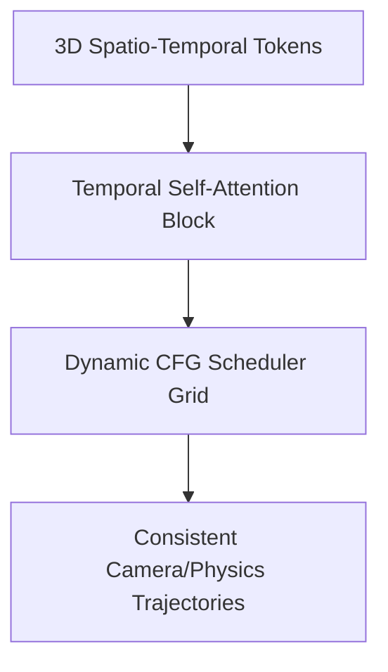

# Spatio-Temporal Physics-Consistent Video Synthesis

[← Back to Main README](../README.md)

## Overview
Cinematic video models (such as Sora-class models) apply Classifier-Free Guidance across temporal patches to ensure consistent tracking of objects, light sources, and characters across long video clips.

## Frame Consistency Workflow
By applying dynamic CFG schedulers across spatio-temporal token cubes, the generator keeps details aligned without losing structure over time.

